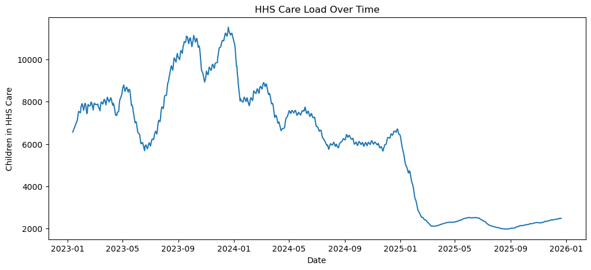
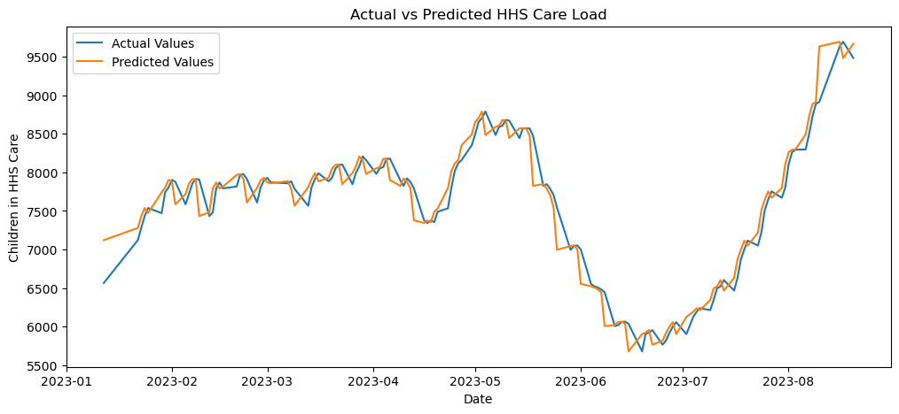
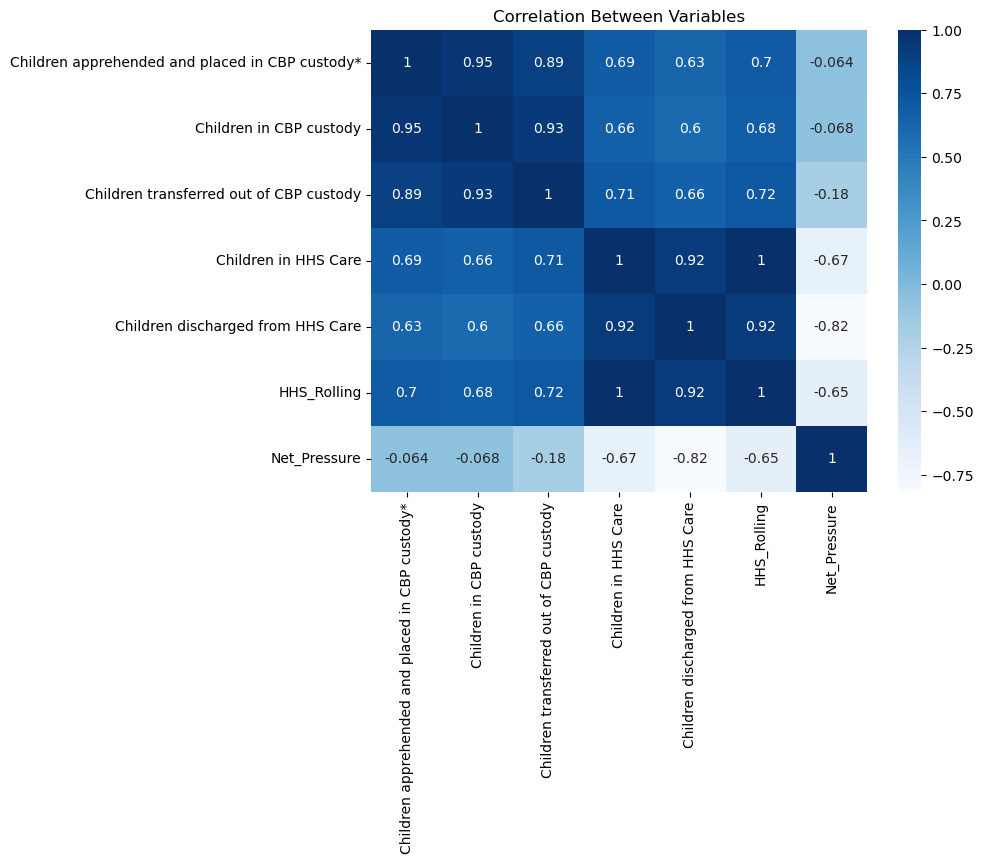
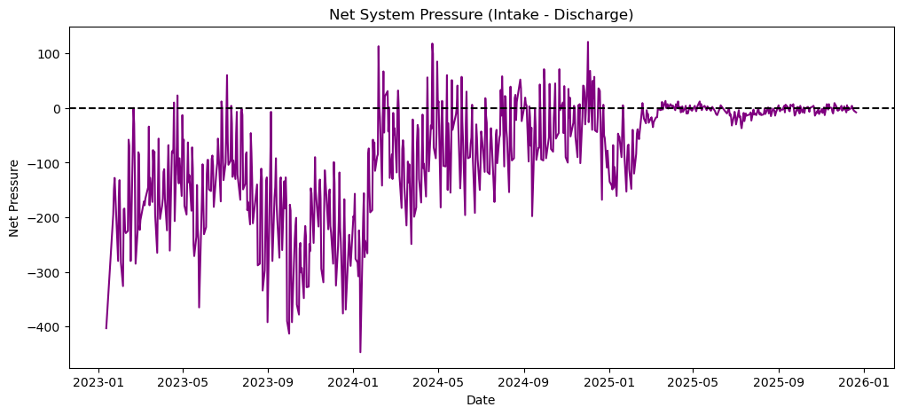

# hhs-load-prediction
"Predictive analytics project focused on HHS care load forecasting and trend analysis"
This project is based on analyzing and forecasting HHS care load trends using Machine Learning. The main objective was to understand historical patterns in the data, study how the care load changes over time, and build a model that can help predict future demand.

The project includes:
- Data cleaning and preprocessing
- Exploratory Data Analysis (EDA)
- Trend and correlation analysis
- Forecast visualization
- Random Forest based prediction model

## Tools & Technologies Used
- Python
- Pandas
- NumPy
- Matplotlib
- Seaborn
- Scikit-learn
- Jupyter Notebook

## Project Highlights

- Performed data cleaning and preprocessing on historical HHS care load data
- Analyzed trends and seasonal behavior in the dataset
- Created visualizations to study care load patterns and system pressure
- Built a Random Forest model for forecasting future care load
- Compared actual vs predicted values to evaluate model performance
- Generated future forecast graphs for trend analysis

## Project Visualizations

### HHS Care Load Trend

### Actual vs Predicted Values

### Correlation Heatmap

### Net System Pressure
  

## Results

The Random Forest forecasting model was able to capture important trends and seasonal patterns in the dataset. The comparison between actual and predicted values showed stable forecasting performance and improved prediction accuracy over the baseline approach.

Key observations from the analysis:
- Seasonal fluctuations were visible in the care load data
- Certain periods showed increased system pressure
- Forecast trends indicated changing demand patterns over time

## Conclusion

This project shows how Machine Learning can help in understanding historical HHS care load trends and predicting future demand patterns. Through data analysis, visualizations, and forecasting, the project helped identify seasonal behavior, changing trends, and periods of increased system pressure. The Random Forest model provided useful forecasting results that can support better planning and decision-making.
